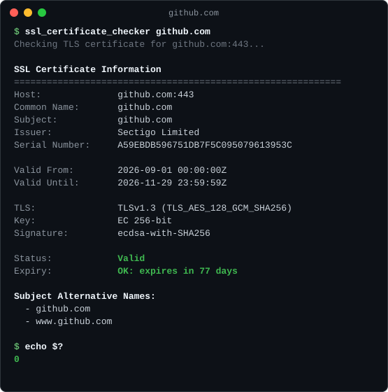
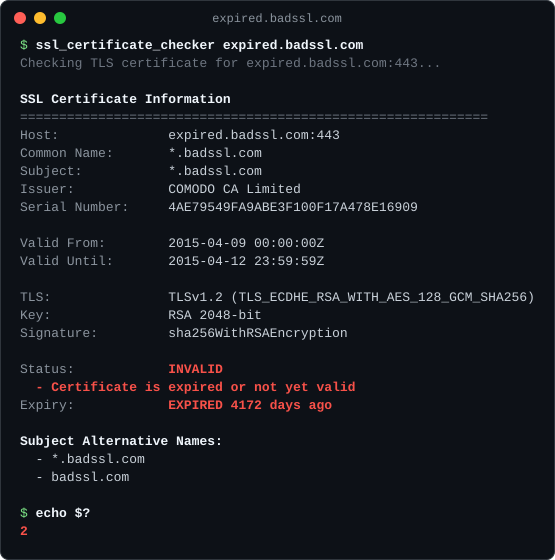

# SSL Certificate Checker

A robust Elixir library for checking and validating SSL/TLS certificates. Get detailed certificate information, expiry warnings, and comprehensive validation with a simple, elegant API.

[](https://hex.pm/packages/ssl_certificate_checker)
[](https://hexdocs.pm/ssl_certificate_checker)

<p align="center">
  
  
</p>

## Features

- **Full Verification** - Checks the chain against the system CA store, the host name, and the validity period, and reports every problem found
- **Expiry Monitoring** - Get precise expiry dates and warnings
- **Detailed Information** - Subject, issuer, SAN domains, key type and size, signature algorithm, negotiated TLS version and cipher
- **No OpenSSL or Shell** - Uses Erlang's built-in `:ssl`, so it runs on Linux, macOS, and Windows and host input never reaches a shell
- **Error Handling** - Comprehensive error handling with meaningful messages
- **Type Safe** - Full type specifications for better code quality
- **CLI Tool** - Command-line interface for quick checks

## Installation

Add `ssl_certificate_checker` to your list of dependencies in `mix.exs`:

```elixir
def deps do
  [
    {:ssl_certificate_checker, "~> 0.2.0"}
  ]
end
```

Then run:

```bash
mix deps.get
```

## Quick Start

```elixir
# Check a certificate
{:ok, cert} = SslCertificateChecker.check("google.com")

# Check certificate validity
{:ok, valid?} = SslCertificateChecker.is_valid?("google.com")

# Get days until expiry
{:ok, days} = SslCertificateChecker.days_until_expiry("google.com")

# Check if expiring soon (within 30 days)
{:ok, expiring?} = SslCertificateChecker.expiring_soon?("google.com")
```

## Usage Examples

### Basic Certificate Check

```elixir
case SslCertificateChecker.check("google.com") do
  {:ok, cert_info} ->
    IO.puts("Subject: #{cert_info.subject}")
    IO.puts("Issuer: #{cert_info.issuer}")
    IO.puts("Valid until: #{cert_info.valid_until}")
    IO.puts("Days until expiry: #{cert_info.days_until_expiry}")
    IO.puts("Is valid: #{cert_info.is_valid}")
    IO.puts("Problems: #{inspect(cert_info.verification_errors)}")

  {:error, reason} ->
    IO.puts("Error: #{inspect(reason)}")
end
```

### Custom Port

```elixir
# Check certificate on a custom port
{:ok, cert} = SslCertificateChecker.check("example.com", 8443)
```

### With Timeout

```elixir
# Set a custom timeout (in milliseconds)
{:ok, cert} = SslCertificateChecker.check("example.com", 443, timeout: 5000)
```

### Private CA

```elixir
# Trust a specific CA instead of the operating system's store
[{:Certificate, ca_der, _}] = :public_key.pem_decode(File.read!("internal-ca.pem"))
{:ok, cert} = SslCertificateChecker.check("internal.example", 443, cacerts: [ca_der])
```

### Monitoring Certificate Expiry

```elixir
defmodule CertMonitor do
  def check_certificates(hosts) do
    hosts
    |> Enum.map(fn host ->
      case SslCertificateChecker.check(host) do
        {:ok, cert} ->
          %{
            host: host,
            days_remaining: cert.days_until_expiry,
            status: cert_status(cert)
          }

        {:error, reason} ->
          %{host: host, error: reason}
      end
    end)
  end

  defp cert_status(cert) do
    cond do
      not cert.is_valid -> :invalid
      cert.days_until_expiry < 0 -> :expired
      cert.days_until_expiry <= 7 -> :critical
      cert.days_until_expiry <= 30 -> :warning
      true -> :ok
    end
  end
end

# Usage
hosts = ["google.com", "github.com", "example.com"]
results = CertMonitor.check_certificates(hosts)
```

### Checking Multiple Hosts Concurrently

```elixir
hosts = ["google.com", "github.com", "stackoverflow.com"]

results =
  hosts
  |> Task.async_stream(
    fn host ->
      case SslCertificateChecker.check(host) do
        {:ok, cert} -> {host, :ok, cert.days_until_expiry}
        {:error, reason} -> {host, :error, reason}
      end
    end,
    timeout: 10_000,
    max_concurrency: 10
  )
  |> Enum.map(fn {:ok, result} -> result end)

Enum.each(results, fn
{host, :ok, days} ->
  IO.puts("#{host}: #{days} days until expiry")

{host, :error, reason} ->
  IO.puts("#{host}: error - #{inspect(reason)}")

end)
```

## API Reference

### Main Functions

#### `check(host, port \\ 443, opts \\ [])`

Connects to the host and returns the certificate it presents. A certificate that fails
verification is still returned; check `is_valid` and `verification_errors`.

`host` must be a DNS hostname or an IP address. URLs, `host:port` strings, and anything
containing whitespace or shell metacharacters return `{:error, :invalid_host}` without
connecting.

**Options:**
- `:timeout` - Connection and handshake timeout in milliseconds (default: 10000)
- `:cacerts` - DER-encoded CA certificates to trust instead of the system store

**Returns:**
- `{:ok, certificate_info}` - Success with certificate details
- `{:error, reason}` - Failure with error reason

**Certificate Info Map:**
```elixir
%{
  subject: "Organization Name",          # O, or CN if there is no O
  issuer: "Certificate Authority",
  common_name: "*.example.com",
  san_domains: ["*.example.com", "example.com"],
  serial_number: "4F1C...",
  valid_from: ~U[2026-01-01 00:00:00Z],
  valid_until: ~U[2027-01-01 00:00:00Z],
  days_until_expiry: 45,
  is_valid: true,                        # trusted, matches host, within validity period
  verification_errors: [],               # e.g. [:unknown_ca, :hostname_check_failed]
  signature_algorithm: "sha256WithRSAEncryption",
  key_type: "RSA",                       # "RSA", "EC", "Ed25519", ...
  key_size: 2048,                        # nil when not applicable
  tls_version: "TLSv1.3",
  cipher_suite: "TLS_AES_256_GCM_SHA384"
}
```

**Verification errors** you're most likely to see:
- `:unknown_ca` - The chain doesn't lead to a trusted root
- `:selfsigned_peer` - The certificate is self-signed
- `:hostname_check_failed` - The certificate doesn't cover the requested host
- `:cert_expired` - The certificate is expired or not yet valid

#### `is_valid?(host, port \\ 443, opts \\ [])`

Checks that the certificate is trusted, matches the host, and is within its validity period.

**Returns:**
- `{:ok, true}` - Certificate is valid
- `{:ok, false}` - Certificate failed verification
- `{:error, reason}` - Error occurred

#### `days_until_expiry(host, port \\ 443, opts \\ [])`

Gets the number of days until the certificate expires.

**Returns:**
- `{:ok, days}` - Number of days (negative if expired)
- `{:error, reason}` - Error occurred

#### `expiring_soon?(host, port \\ 443, opts \\ [])`

Checks if certificate expiry is within the warning threshold.

**Options:**
- `:warning_days` - Days threshold (default: 30)

**Returns:**
- `{:ok, true}` - Certificate is expiring soon
- `{:ok, false}` - Certificate is not expiring soon
- `{:error, reason}` - Error occurred

## Command Line Interface

### Building the Executable

```bash
MIX_ENV=prod mix escript.build
./ssl_certificate_checker google.com
```

The escript needs only Erlang/OTP 25+ installed to run. On Windows, run it with
`escript ssl_certificate_checker google.com`.

### Usage

```bash
# Basic check
ssl_certificate_checker google.com

# Custom port
ssl_certificate_checker example.com 8443

# JSON output
ssl_certificate_checker google.com --json

# Shorter timeout (milliseconds)
ssl_certificate_checker example.com --timeout 3000

# Trust a private CA (PEM file; may be repeated)
ssl_certificate_checker internal.example --cacert internal-ca.pem
```

### JSON Output

With `--json`, stdout contains exactly one JSON object and nothing else, whether the check
succeeds or fails, so it can be piped into `jq` or read by other programs. Successful checks
include every field from `check/3` plus `host` and `port`:

```json
{
  "host": "self-signed.badssl.com",
  "port": 443,
  "is_valid": false,
  "verification_errors": ["selfsigned_peer"],
  "days_until_expiry": 725,
  "valid_until": "2028-09-07T21:00:17Z",
  "tls_version": "TLSv1.2",
  "...": "..."
}
```

Failures use `error` for the machine-readable reason and `message` for a description:

```json
{
  "host": "does-not-exist.invalid",
  "port": 443,
  "error": "nxdomain",
  "message": "Host name does not resolve"
}
```

### Exit Codes

- `0` - Certificate is valid
- `1` - Check could not be completed (invalid arguments, network or TLS error)
- `2` - Certificate was retrieved but failed verification

## Error Handling

The library returns standardized error atoms:

- `:invalid_host` - Not a valid hostname or IP address
- `:invalid_port` - Port outside 1..65535
- `:no_trusted_certificates` - The CA store is empty or couldn't be loaded
- `:nxdomain` - The hostname doesn't resolve
- `:connection_refused` - Nothing is listening on that port
- `:timeout` - Connection or handshake timed out
- `{:connection_failed, posix_reason}` - Other network error, e.g. `:ehostunreach`
- `{:tls_handshake_failed, message}` - The server doesn't speak TLS or rejected the handshake
- `:invalid_certificate` - The certificate couldn't be decoded

```elixir
case SslCertificateChecker.check("example.com") do
  {:ok, %{is_valid: true} = cert} ->
    IO.puts("Valid, expires in #{cert.days_until_expiry} days")

  {:ok, cert} ->
    IO.puts("Certificate problems: #{inspect(cert.verification_errors)}")

  {:error, :invalid_host} ->
    IO.puts("Invalid hostname provided")

  {:error, :timeout} ->
    IO.puts("Connection timed out")

  {:error, reason} ->
    IO.puts("Could not check certificate: #{inspect(reason)}")
end
```

## Docker Support

The image contains only the Erlang runtime and the escript, and runs as an unprivileged user.
Arguments are passed straight to the CLI:

```bash
docker build -t ssl-certificate-checker .
docker run --rm ssl-certificate-checker google.com
docker run --rm ssl-certificate-checker example.com 8443 --json

# Trust a private CA by mounting it into the container
docker run --rm -v "$PWD/internal-ca.pem:/ca.pem:ro" ssl-certificate-checker internal.example --cacert /ca.pem
```

## Requirements

- Elixir ~> 1.14
- Erlang/OTP 25+ (for access to the system CA store)

OpenSSL is not required.

## Testing

```bash
# Run tests (offline; uses local TLS servers with generated certificates)
mix test

# Also run tests against public hosts such as badssl.com
mix test --include external

# Run with coverage
mix coveralls

# Run with coverage HTML report
mix coveralls.html

# Run linter
mix credo

# Run type checker
mix dialyzer
```

## Development

```bash
# Get dependencies
mix deps.get

# Run tests
mix test

# Generate documentation
mix docs

# Format code
mix format

# Regenerate the README screenshots (uses live certificates)
MIX_ENV=prod mix escript.build && elixir scripts/render_cli_screenshots.exs
```

## Performance

The library is designed for efficiency:

- Async operations with configurable timeouts
- No heavy dependencies
- Efficient parsing
- Concurrent checking support

Typical check takes 100-500ms depending on network latency.

## Security Considerations

- Host names are validated strictly and passed to Erlang's `:ssl` directly; no shell or external process is involved
- A check completes the TLS handshake even when verification fails so the certificate can be inspected, but no application data is ever sent. Don't reuse this to decide whether to trust a connection for real traffic
- Revocation (CRL/OCSP) is not checked yet
- Only TLS 1.2 and 1.3 are negotiated; servers limited to older versions return `{:tls_handshake_failed, _}`
- Certificate fields such as subject and SAN are chosen by whoever runs the server; treat them as untrusted input
- Checking arbitrary user-supplied hosts can be abused to probe internal networks; restrict hosts and ports if you expose this as a service
- Use appropriate timeouts and consider rate limiting when checking many hosts

## Contributing

Contributions are welcome! Please feel free to submit a Pull Request.

1. Fork the repository
2. Create your feature branch (`git checkout -b feature/amazing-feature`)
3. Commit your changes (`git commit -am 'Add amazing feature'`)
4. Push to the branch (`git push origin feature/amazing-feature`)
5. Open a Pull Request

## License

This project is licensed under the MIT License - see the LICENSE file for details.

## Acknowledgments

- Built with ❤️ using Elixir
- Uses Erlang/OTP's `:ssl` and `:public_key` for certificate inspection
- Inspired by the need for simple certificate monitoring

## Changelog

### v0.2.0
- Complete rewrite with improved error handling
- Added comprehensive type specifications
- Added CLI interface
- Improved certificate parsing
- Added SAN domain extraction
- Better timeout handling
- Comprehensive test suite

### v0.1.0
- Initial release
- Basic certificate checking
